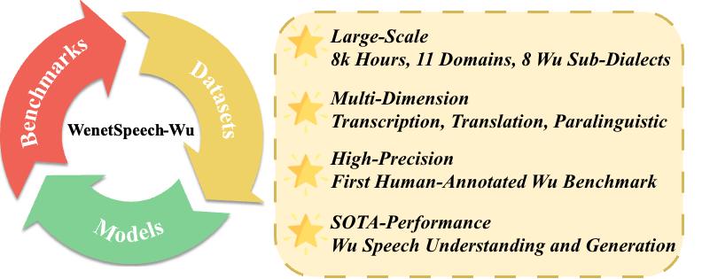
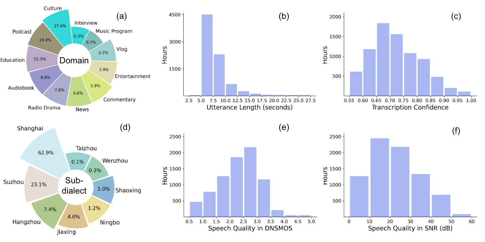

# WenetSpeech-Wu: Datasets, Benchmarks, and Models for a Unified Chinese Wu Dialect Speech Processing Ecosystem

This repository contains the official WenetSpeech-Wu dataset, the WenetSpeech-Wu benchmark, and related models.

<div align="center"></div>

## 📢 Demo Page 

The demo page provides audio samples.  
👉 **Demo:** [Demo Page](https://anonymous.4open.science/w/WenetSpeechWu-Demo-Page-51A8/)


## Download
* The WenetSpeech-Wu dataset will be available at [WenetSpeech-Wu](README.md).
* The WenetSpeech-Wu benchmark will be  available at [WenetSpeech-Wu-Bench](Benchmark/README.md).
* The ASR and understanding models will be available at [WSWu-Understanding](Understanding/README.md).
* The TTS and instruct TTS models will be available at [WSWu-Generation](Generation/README.md).


## Dataset
### WenetSpeech-Wu Overview
<div align="center"></div>
WenetSpeech-Wu is the first large-scale Wu dialect speech corpus with multi-dimensional annotations. It contains rich metadata and annotations, including transcriptions with confidence scores, Wu-to-Mandarin translations, domain and sub-dialect labels, speaker attributes, emotion annotations, and audio quality measures. The dataset comprises approximately 8,000 hours of speech collected from diverse domains and covers eight Wu sub-dialects. To support a wide range of speech processing tasks with heterogeneous quality requirements, we further adopt a task-specific data quality grading strategy.

<p align="center">

</p>

## WenetSpeech-Wu-Bench

We introduce WenetSpeech-Wu-Bench, the first publicly available, manually curated benchmark for Wu dialect speech processing, covering ASR, Wu-to-Mandarin AST, speaker attributes, emotion recognition, TTS, and instruct TTS, and providing a unified platform for fair evaluation.

- **ASR:** Wu dialect ASR (9.75 hour, Shanghainese, Suzhounese, and Mandarin code-mixed speech). Evaluated by CER.
- **Wu→Mandarin AST:** Speech translation from Wu dialects to Mandarin (3k utterances, 4.4h). Evaluated by BLEU.
- **Speaker & Emotion:** Speaker gender/age prediction and emotion recognition on Wu speech. Evaluated by classification accuracy.
- **TTS:** Wu dialect TTS with speaker prompting (242 sentences, 12 speakers). Evaluated by speaker similarity, CER, and MOS.
- **Instruct TTS:** Instruction-following TTS with prosodic and emotional control. Evaluated by automatic accuracy and subjective MOS.


## Data Construction Pipeline for WenetSpeech-Wu

We propose an automatic and scalable pipeline for constructing a large-scale Wu dialect speech dataset with multi-dimensional annotations, as illustrated in the figure below. The pipeline is designed to enable efficient data collection, robust automatic transcription, and diverse downstream annotations.
<p align="center">

</p>

## ASR & Speech Understanding Inference

This section describes the inference procedures for different speech models used in our experiments, including **Conformer-U2pp-Wu**, **Whisper-Medium-Wu**, **Step-Audio2-Wu-ASR** and **Step-Audio2-Wu-Und**.
Different models are trained and inferred under different frameworks, with corresponding data formats.

---
<!--

### Data Format

#### Conformer-U2pp / Whisper-Medium

The inference data is provided in **JSONL** format, where each line corresponds to one utterance:

```json
{"key": "xxxx", "wav": "xxxxx", "txt": "xxxx"}
````

* `key`: utterance ID
* `wav`: path to the audio file
* `txt`: reference transcription (optional during inference)

---

#### Step-Audio2

The inference data follows a **multi-modal dialogue format**, where audio is provided explicitly:

```json
{
  "messages": [
    {
      "role": "user",
      "content": "<audio>语音说了什么"
    },
    {
      "role": "assistant",
      "content": "xxxx"
    }
  ],
  "audios": [
    "xxxx"
  ]
}
```

* `messages`: dialogue-style input/output
* `audios`: path(s) to the audio file(s)

---
 -->
## Conformer-U2pp-Wu

```bash
dir=exp
data_type=raw
decode_checkpoint=$dir/u2++.pt
decode_modes="attention attention_rescoring ctc_prefix_beam_search ctc_greedy_search"
decode_batch=4
test_result_dir=./results
ctc_weight=0.0
reverse_weight=0.0
decoding_chunk_size=-1

python wenet/bin/recognize.py --gpu 0 \
  --modes ${decode_modes} \
  --config $dir/train.yaml \
  --data_type $data_type \
  --test_data $test_dir/$test_set/data.jsonl \
  --checkpoint $decode_checkpoint \
  --beam_size 10 \
  --batch_size ${decode_batch} \
  --blank_penalty 0.0 \
  --ctc_weight $ctc_weight \
  --reverse_weight $reverse_weight \
  --result_dir $test_result_dir \
  ${decoding_chunk_size:+--decoding_chunk_size $decoding_chunk_size}
```

This setup supports multiple decoding strategies, including attention-based and CTC-based decoding.

---

## Whisper-Medium-Wu

```bash
dir=exp
data_type=raw
decode_checkpoint=$dir/whisper.pt
decode_modes="attention attention_rescoring ctc_prefix_beam_search ctc_greedy_search"
decode_batch=4
test_result_dir=./results
ctc_weight=0.0
reverse_weight=0.0
decoding_chunk_size=-1

python wenet/bin/recognize.py --gpu 0 \
  --modes ${decode_modes} \
  --config $dir/train.yaml \
  --data_type $data_type \
  --test_data $test_dir/$test_set/data.jsonl \
  --checkpoint $decode_checkpoint \
  --beam_size 10 \
  --batch_size ${decode_batch} \
  --blank_penalty 0.0 \
  --ctc_weight $ctc_weight \
  --reverse_weight $reverse_weight \
  --result_dir $test_result_dir \
  ${decoding_chunk_size:+--decoding_chunk_size $decoding_chunk_size}
```


## Step-Audio2-Wu-ASR & Step-Audio2-Wu-Und

```bash
model_dir=Step-Audio-2-mini 
adapter_dir=./checkpoints

CUDA_VISIBLE_DEVICES=0 \
swift infer \
  --model $model_dir \
  --adapters $adapter_dir \
  --val_dataset data.jsonl \
  --max_new_tokens 512 \
  --torch_dtype bfloat16 \
  --result_path results.jsonl
```

---

<!--
## Speech Understanding Tasks

The inference script is identical to that of Step-Audio2 described above; only the user prompt needs to be modified for different tasks.
```json
{
  "ASR": "<audio>请记录下你所听到的语音内容。",
  "AST": "<audio>请仔细聆听这段语音，然后将其内容翻译成普通话。",
  "age": "<audio>请根据语音的声学特征，判断说话人的年龄，从儿童、少年、青年、中年、老年中选一个标签。",
  "gender": "<audio>请根据语音的声学特征，判断说话人的性别，从男性、女性中选一个标签。",
  "emotion": "<audio>请根据语音的声学特征和语义，判断语音的情感，从中立、高兴、难过、惊讶、生气选一个标签。"
}
```
 -->
## TTS Inference

coming soon


## Contributors
## Citation

## Contact

